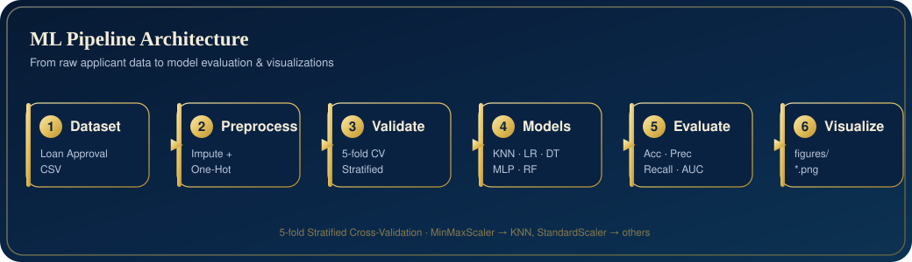

<p align="center">
  
</p>

<h1 align="center">AI-Powered Loan Approval Prediction System</h1>

<p align="center">
  
  
  
  
  
  
  
  
</p>

<p align="center">
  <a href="#-installation--usage">🚀 Getting Started</a> &nbsp;•&nbsp;
  <a href="#%EF%B8%8F-pipeline-architecture">🏗️ Architecture</a> &nbsp;•&nbsp;
  <a href="#-methodology">🧠 Methodology</a> &nbsp;•&nbsp;
  <a href="#-results--visualizations">📈 Results</a> &nbsp;•&nbsp;
  <a href="#-future-improvements">🔮 Roadmap</a>
</p>

## 📄 Overview
This project is a Machine Learning pipeline designed to automate the loan eligibility process. It analyzes applicant data to predict whether a loan should be **Approved** or **Rejected**. 

The system implements multiple classification algorithms to determine the most accurate model, performing comprehensive data preprocessing, feature scaling, and visualization of performance metrics.

## 📊 Features
* **Leak-Free Preprocessing:** A scikit-learn `Pipeline` + `ColumnTransformer` imputes missing values (median for numeric, most-frequent for categorical) and **One-Hot encodes** categories — all fitted inside cross-validation so no information leaks from test to train.
* **Exploratory Data Analysis (EDA):** Visualizes class distribution and feature correlations.
* **Multi-Model Comparison:** Trains and evaluates five distinct algorithms:
    * K-Nearest Neighbors (KNN)
    * Logistic Regression
    * Decision Tree Classifier
    * Neural Network (MLPClassifier)
    * Random Forest Classifier
* **Adaptive Scaling:** Applies `MinMaxScaler` for distance-based algorithms (KNN) and `StandardScaler` for others.
* **Honest Evaluation:** Uses **5-fold Stratified Cross-Validation** (out-of-fold predictions) instead of a single split, and reports Accuracy, Precision, Recall, **F1** and **ROC AUC** against a majority-class baseline.
* **Performance Visualization:** Generates Confusion Matrices, ROC Curves, and metric comparison charts.

## 🛠️ Tech Stack
* **Language:** Python
* **Data Manipulation:** Pandas, NumPy
* **Visualization:** Matplotlib, Seaborn
* **Machine Learning:** Scikit-Learn (sklearn)

## 🏗️ Pipeline Architecture

The project runs as a single end-to-end pipeline — from the raw CSV all the way to saved evaluation figures:

<p align="center">
  
</p>

## 📂 Dataset
The project relies on `Loan Approval Dataset.csv`. 
* **Input Features:** Applicant demographics, credit history, income, etc.
* **Target Variable:** `loan_status` (Approved/Rejected).

## 🚀 Installation & Usage

1.  **Clone the repository:**
    ```bash
    git clone https://github.com/Danial-Dirar/CreditSense-AI.git
    cd CreditSense-AI
    ```

2.  **(Recommended) Create a virtual environment:**
    ```bash
    python3 -m venv venv
    source venv/bin/activate  # On Windows: venv\Scripts\activate
    ```

3.  **Install dependencies:**
    ```bash
    pip install -r requirements.txt
    ```

4.  **Place your dataset:**
    Ensure `Loan Approval Dataset.csv` is in the root directory (it is already included in this repo).

5.  **Run the script:**
    ```bash
    python main.py
    ```

## 🧠 Methodology

### 1. Data Preprocessing
* **ID Removal:** `Loan_ID` is dropped — it is a unique identifier, not a predictive feature.
* **Missing Values:** Numeric columns are imputed with the **median**; categorical columns with the **most-frequent** value.
* **Encoding:** Categorical text is converted with **One-Hot Encoding** (avoids the false ordinal ordering that `LabelEncoder` would impose on unordered categories).
* **Leakage Control:** All of the above live inside a `Pipeline` that is fitted *within* each cross-validation fold, so the test fold never influences preprocessing.

### 2. Model Training
The system compares five models, with model-specific scaling:
* **KNN:** Uses `MinMaxScaler` (sensitive to data magnitude).
* **Logistic Regression, Decision Tree, Neural Network, Random Forest:** Use `StandardScaler`.

Evaluation uses **5-fold Stratified Cross-Validation** with out-of-fold predictions, so every row is scored by a model that never trained on it — much more reliable than a single train/test split on a small (614-row) dataset.

### 3. Evaluation Metrics
Because the classes are imbalanced (~69% Approved), the models are judged on more than accuracy:
* **Accuracy:** Overall correctness — compared against a majority-class **baseline (~0.69)**.
* **Precision, Recall & F1:** To balance False Positives vs False Negatives (crucial when approving risky loans is costly).
* **ROC AUC Score:** The primary ranking metric — measures the model's ability to distinguish Approved from Rejected regardless of threshold.

## 📈 Results & Visualizations

Running the script automatically creates a **`figures/`** folder and saves every plot there as a `.png` file (the plots are also displayed on screen). The generated figures are:

| File | Description |
| --- | --- |
| `01_class_distribution.png` | **Class Distribution** — checks for dataset imbalance. |
| `02_correlation_heatmap.png` | **Correlation Heatmap** — identifies relationships between features. |
| `03_model_accuracy.png` | **Model Accuracy Comparison** — accuracy of all five models vs the majority-class baseline. |
| `04_precision_recall.png` | **Precision / Recall / F1** — the three metrics for each model. |
| `05_confusion_matrix_<model>.png` | **Confusion Matrices** — one per model (KNN, Logistic Regression, Decision Tree, Neural Network, Random Forest). |
| `06_roc_curve.png` | **ROC Curve Comparison** — True Positive Rate vs False Positive Rate for all models. |

> The `figures/` folder is created automatically on each run, so you don't need to make it manually.

## 🔮 Future Improvements
* Implement Hyperparameter Tuning (GridSearchCV) to optimize model performance.
* Deploy the best model using Streamlit or Flask as a web app.
* Add Feature Importance analysis (SHAP values) to explain *why* a loan was rejected.

## 🤝 Contributing
Contributions are welcome! Please open an issue or submit a pull request for any improvements.

## 🎓 Credits
This project was originally built as a course submission for the Artificial Intelligence course, Section 5, by student IDs **24241314** and **22101931**. The main script was later renamed from `5_24241314_22101931.py` to `main.py` for clarity.

## 📜 License
This project is open-source and available under the [MIT License](LICENSE).
